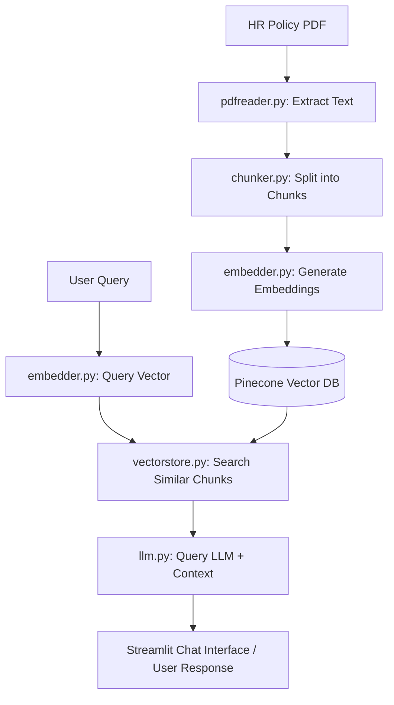

# 💼 RAG HR Policy Assistant

An AI-powered **Retrieval-Augmented Generation (RAG)** assistant that answers employee questions based on company HR policy documents using **Pinecone Vector Database**, **Google Gemini API**, and **Streamlit**.

---

## 🚀 Features

- 📄 **PDF Processing & Chunking**: Reads HR policy PDFs and splits them into optimized text chunks with overlap.
- ⚡ **Vector Embeddings**: Generates dense vector representations using Google Gemini `gemini-embedding-001` (768 dimensions).
- 🗄️ **Self-Healing Vector DB**: Manages Pinecone vector indexes automatically (auto-creates or re-indexes based on dimension requirements).
- 🧠 **Context-Aware LLM Responses**: Generates accurate, non-hallucinated answers strictly from retrieved context using `gemini-3.5-flash-lite`.
- 💻 **Streamlit Web UI**: User-friendly chat application with real-time streaming, retrieved source viewer, and on-the-fly PDF upload & indexing.

---

## 📁 Project Structure

```
RAG_HR_ASSISTANT-main/
│
├── app.py                # Streamlit Chat Web Interface
├── QueryProcessor.py     # Embeds query, retrieves Pinecone matches & calls LLM
├── dataprocessor.py      # Main pipeline: Reads PDF -> Chunks -> Embeds -> Stores in Pinecone
├── embedder.py           # Generates vector embeddings via API
├── vectorstore.py        # Pinecone database initialization & search functions
├── llm.py                # Sends query + retrieved context to LLM
├── pdfreader.py          # Extracts text pages from PDF documents
├── chunker.py            # Text chunking logic with overlap
├── requirements.txt      # Python dependencies list
├── .env                  # API keys and environment configuration
└── resources/
    └── HRPolicy.pdf      # Sample HR Policy PDF
```

---

## 🛠️ Prerequisites & Installation

### 1. Prerequisites
- Python 3.10 or higher
- [Pinecone Account](https://app.pinecone.io/) (Free tier)
- [Google AI Studio Account](https://aistudio.google.com/) (Free Gemini API Key)

### 2. Install Dependencies
Clone or download the repository, open terminal in the project directory, and run:

```bash
pip install -r requirements.txt
```

---

## ⚙️ Environment Setup (`.env`)

Create a `.env` file in the root directory and configure your keys:

```env
# Free Gemini API Key from Google AI Studio (starts with AIzaSy...)
OPENAI_API_KEY=AIzaSy...your_gemini_api_key...

# Gemini OpenAI-compatible base URL
OPENAI_BASE_URL=https://generativelanguage.googleapis.com/v1beta/openai/

# Gemini Models
EMBEDDING_MODEL=gemini-embedding-001
LLM_MODEL=gemini-3.5-flash-lite

# Pinecone Vector Database Configuration
PINECONE_API_KEY=your_pinecone_api_key
PINECONE_INDEX_NAME=hr-assistant
```

---

## 🎯 How to Run

### 1. Process & Store PDF Documents in Vector Database
To parse `resources/HRPolicy.pdf`, generate embeddings, and store them in Pinecone:

```bash
python dataprocessor.py
```

### 2. Run Command-Line Query Test
To test query processing in terminal:

```bash
python QueryProcessor.py
```

### 3. Launch the Streamlit Web Application
To start the interactive web app:

```bash
streamlit run app.py
```

Once launched, open your web browser at **`http://localhost:8501`**.

---

## 📊 RAG Architecture Flow



---

## 📜 License
This project is licensed under the MIT License.
